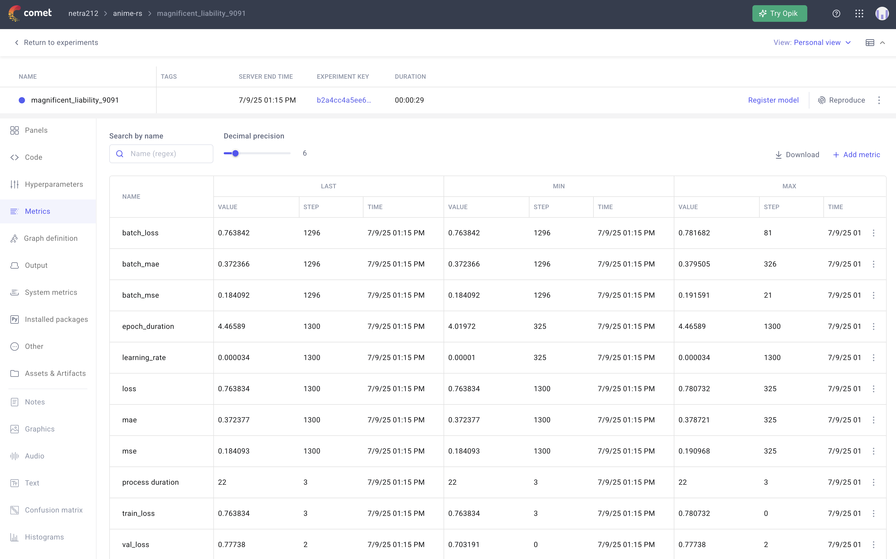
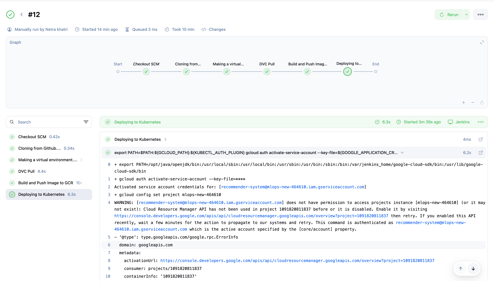
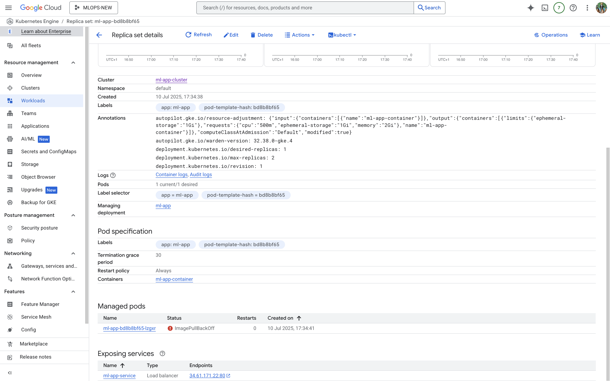

# 🎌 Anime Recommendation System (End-to-End MLOps Project)

An end-to-end scalable and modular **Anime Recommendation System**, built with modern machine learning and MLOps practices. This project leverages **GCP, DVC, Comet-ML, Jenkins, and Kubernetes** for a fully automated, reproducible, and cloud-deployable recommendation pipeline.

---

## 📌 Project Overview

This system recommends anime titles to users based on their preferences, using both **content-based** and **collaborative filtering** techniques. Built with modularity, scalability, and reproducibility in mind — it's production-ready with CI/CD pipelines and cloud deployment via Kubernetes.

--- 

An AI-powered **Anime Recommendation System** built with a full MLOps lifecycle integrating:
- ✅ CI/CD with Jenkins
- ✅ Model Tracking with Comet-ML
- ✅ Data Versioning with DVC
- ✅ Containerization with Docker & Kubernetes
- ✅ Cloud deployment using GCP (Google Cloud Platform)

> 📊 **Final Validation Loss:** 0.777  
> 📉 **MAE:** 0.372  
> 🔧 **Optimizer:** Adam | **Loss:** Binary Crossentropy

---

## 📁 Project Structure

```bash
.
├── .dvc/                        # DVC metadata
├── artifacts/                  # Datasets, models, checkpoints
│   ├── raw/processed/model/...
├── CI-CD-Deployment-Stages/
│   └── ci_cd_stages.txt        # Stages for Jenkins pipeline
├── config/
│   ├── config.yaml             # Model & training configuration
│   ├── paths_config.py
├── custom_jenkins/
│   └── Dockerfile              # Jenkins agent with dependencies
├── notebook/
│   └── anime.ipynb             # EDA + experiment exploration
├── pipeline/
│   ├── training_pipeline.py
│   └── prediction_pipeline.py
├── src/
│   ├── base_model.py
│   ├── model_training.py
│   ├── data_ingestion.py
│   ├── data_preprocessing.py
│   ├── custom_exception.py
│   └── logger.py
├── utils/
│   ├── helpers.py
│   └── common_functions.py
├── static/                     # CSS files for frontend
├── templates/                  # HTML templates
│   └── index.html              # Frontend UI
├── Dockerfile                  # API/Model Docker setup
├── deployment.yaml             # Kubernetes deployment config
├── Jenkinsfile                 # Jenkins CI/CD pipeline
├── requirements.txt
├── setup.py
├── application.py              # FastAPI/Flask app
└── README.md
```

---

## Anime Recommender App


---

## 📌 Project Components Overview

| Component          | Description                                        |
|------------------  |----------------------------------------------------|
| **Frameworks**     | TensorFlow, NumPy, Pandas                          |
| **MLOps Tools**    | Comet-ML, DVC, Jenkins, Docker, Kubernetes, GCP    |
| **Frontend**       | HTML5, CSS3                                        |
| **Model**          | Custom-built Neural Network                        |
| **Embedding Size** | 128                                                |
| **Loss**           | Binary Crossentropy                                |
| **Optimizer**      | Adam                                               |
| **Metrics**        | MAE, MSE                                           |
| **Deployment**     | GCP Kubernetes Cluster                             |

---

## 📈 Comet-ML Metrics & Model Performance

| Metric            | Value     |
|-------------------|-----------|
| `train_loss`      | 0.7638    |
| `val_loss`        | 0.7773    |
| `batch_mae`       | 0.3723    |
| `batch_mse`       | 0.1840    |
| `mae`             | 0.372     |
| `mse`             | 0.184     |
| `learning_rate`   | 0.000034  |
| `epoch_duration`  | ~4.46 sec |

---

## 🧪 How to Run Locally

### 1. Clone the repo
```
git clone https://github.com/netra212/anime-rs.git
cd anime-rs
```

### 2. Create and activate virtualenv
```
python -m venv animeenv

source animeenv/bin/activate
```

### 3. Install dependencies
```pip install -r requirements.txt```

### 4. Trigger training pipeline
```python pipeline/training_pipeline.py```

### 5. Launch API (Flask/FastAPI)
```python application.py```


---

## 📦 CI/CD Pipeline (Jenkins + Docker + GCP Kubernetes)

```
    A[Git Commit] --> B[Jenkins CI/CD];
    B --> C[Run Unit Tests];
    C --> D[Build Docker Image];
    D --> E[Push to Google Container Registry (GCR)];
    E --> F[Deploy to GCP Kubernetes Cluster];
```
---

## 📂 Data Versioning (via DVC)

This project uses **DVC (Data Version Control)** to manage and version datasets and model artifacts across the ML pipeline stages:

- 📥 **Stages Tracked:** `raw` → `processed` → `model`
- 📊 **Tracked Files:** `.dvc` metadata files capture pipeline states and metrics.
- ☁️ **Remote Storage:** GCP Bucket (`gs://......`)

### 🚀 Key Commands

```bash
# Initialize DVC in the project
dvc init

# Track raw data
dvc add artifacts/raw

# Push data to remote storage
dvc push -r myremote
```

---

## 🌐 Deployment (GCP + Kubernetes)

This project is fully containerized and deployed on **Google Kubernetes Engine (GKE)** for scalability and reliability.

### 🚢 Deployment Steps:

- 🛠️ **Containerization:** Built a Docker image using a custom `Dockerfile`.
- 📦 **Kubernetes Deployment:** Applied `deployment.yaml` to launch pods and services on GKE.
- ⚙️ **Autoscaling:** Configured Horizontal Pod Autoscaler (HPA) for handling traffic spikes.
- 💾 **Persistent Storage:** Mounted volumes for data and model checkpoints.
- 🌐 **Load Balancing:** Service is exposed to the internet using an external LoadBalancer via Kubernetes `Service`.

> All services run seamlessly inside a Kubernetes-managed cluster on GCP.


---
## 📌 Model Architecture Summary

```yaml
Model:
  Embedding Size: 128
  Optimizer: Adam
  Loss: binary_crossentropy
  Metrics: [mae, mse]
```

## 📊 Comet-ML Metrics Dashboard



---

## 🔄 Jenkins CI/CD Pipeline



---

## ☁️ GCP Kubernetes Deployment



---

## 🧠 Neural Network Architecture


---